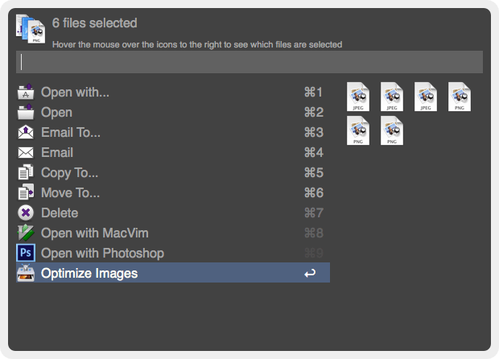
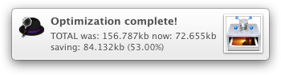
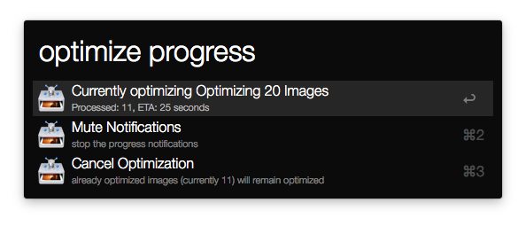

# Image Optimization Workflow for Alfred app

This workflow brings a simple Alfred UI to the command line library [image_optim](https://github.com/toy/image_optim) from Ivan Kuchin. The library comes bundled with a nice pack of open source libraries as binaries to perform different types of optimizations.

The performed optimizations are _lossy_, which means that the original images will loose some (hardly noticeable) quality. Specifically, it's using pngquant to convert 24 bit pngs to 8 bits png with with full alpha channel, which usually reduces size of PNGs as much as 70% with hardly noticeable quality loss, and a JPEG compression algorithm called [Smallfry](https://github.com/dwbuiten/smallfry) which is similar of what JPEGmini uses.

I'll probably add options to select between lossy and lossless and maybe different compression methods in the future.

## History

Originally this workflow used the [ImageOptim-CLI library](https://github.com/JamieMason/ImageOptim-CLI) from Jamie Mason, which depends on [ImageOptim](http://imageoptim.com/), [ImageAlpha](http://pngmini.com/) and [JPEGmini](http://www.jpegmini.com/) being installed on the system, JPEGmini being a paid app, and since it needs to manipulate JPEGmini with AppleScript, you needed to set the proper permissions for accessibility in your system preferences.

On the other side, the workflow was written in Ruby, which is beautiful and expressive, but I ended up having some problems with native extensions not being compiled exactly for the Ruby version shipped with OSX, which by the way changed from 1.8 to 2.0 from Mavericks forward. In the end, several times I needed to build 2 versions of the workflow for different OSX versions.

The original project is in the ```old-ruby-version``` branch.

## Usage

1. find or select one or more images or folders, show the file actions in Alfred, and select "Optimize Images".
  Note that any Alfred's way of selecting files work, such us:
  * select one or multiple files/folders in finder and press ```⌘ alt \```
  * browsing or finding files in Alfred, and triggering actions for the file
  * saving files in Alfred's file buffer, and then ```alt →``` to action buffered files.

  

2. You'll see a notification indicating the number of files to process. Depending on the number and size of images, it could take a while.

  
  
3. You'll see a progress notification roughly every 30 seconds, which can be ```muted``` (see below).

  

4. When the optimization is completed, you'll see a final report notification with the saved size and percent.

  

**The proccess _replaces_ the images with the optimized versions. Remember to save a copy or work with versioned files.**

When the optimization process is running you can use the ```optimize progress``` keyword to see the progress, ```mute``` the process (avoid progress notifications) and ```cancel``` de process (stops process, leaves already optimized images as is).

  

You cannot run this workflow if a previous process is still running. If you try to run it again, the ```optimize progress``` keyword is immediately fired to check on the current process instead.

## Installation
Download the [alfred-image-optim-workflow.alfredworkflow](alfred-image-optim-workflow.alfredworkflow) and import to Alfred 2.

## Changelog
* _2014-01-06_ - Released
* _2014-01-23_ - Added folder support, and correctly counting number of files inside folders
* _2015-08-28_ - Rebuild workflow around image_optim cli library from Ivan Kuchin and use PHP instead of Ruby
